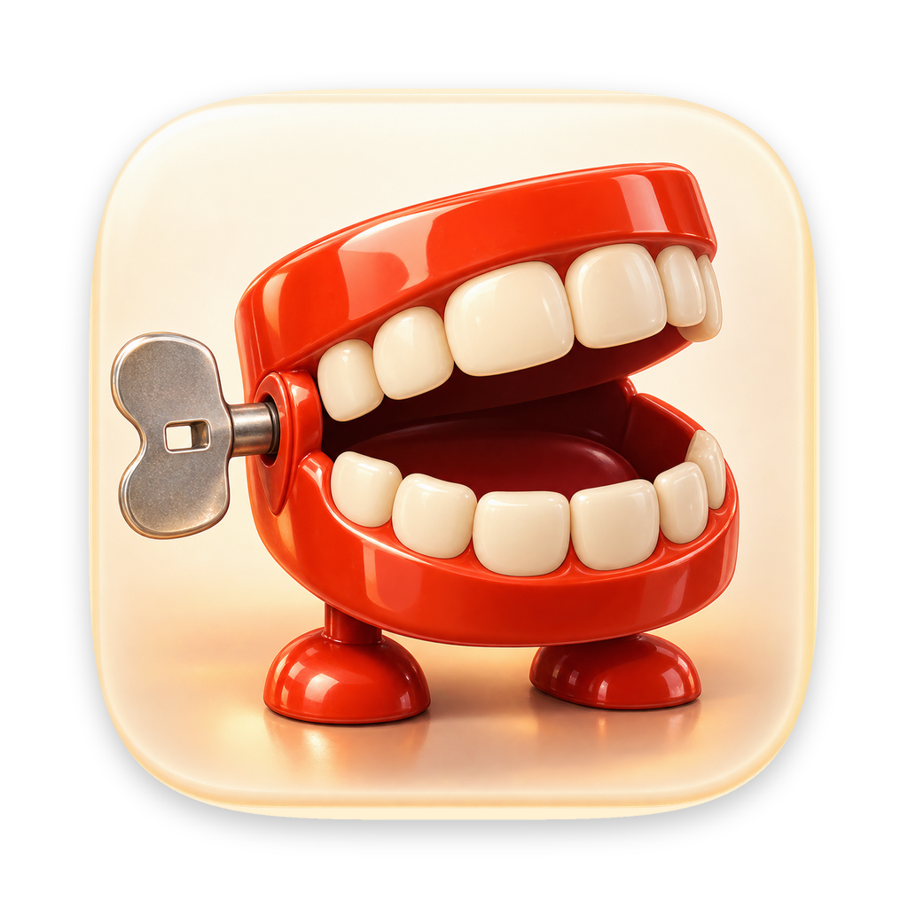
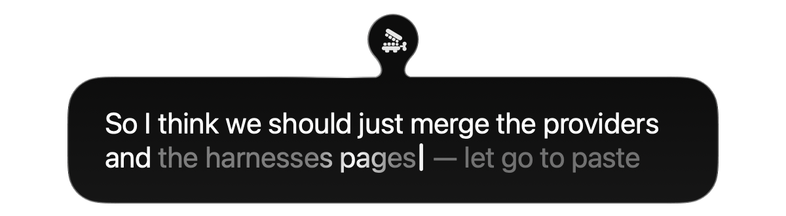
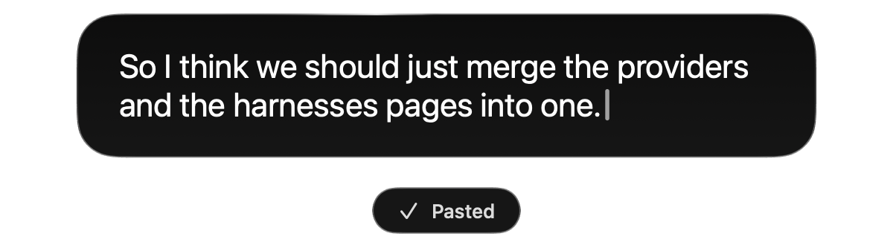

<p align="center">
  
</p>

<h1 align="center">yap</h1>

<p align="center">
  dictation for macos. hold fn, talk, let go, and what you said is pasted wherever your cursor is.<br>
  it runs on the speech model that comes with macos, so nothing leaves your mac and there's nothing to pay for.
</p>

<p align="center">
  
  
</p>

i wrote yap to replace wispr flow, which sat on 1.3 gb of ram and about 5% cpu whether i was talking or not. yap uses apple's `SpeechAnalyzer` and only does anything while you're dictating.

## install

```sh
brew tap 0xdeafcafe/yap https://github.com/0xdeafcafe/yap
brew install --cask yap
```

quit wispr flow first, or you'll get everything pasted twice.

it checks for a new version once a day and asks before installing it, and you can tell it to just get on with it from then on. **check for updates…** in the menu checks now.

macos will ask for two permissions:

- **microphone**, to hear you. it only records while you're dictating.
- **accessibility**, to see fn from any app and to press ⌘V.

## use

| | |
| --- | --- |
| hold `fn` | start listening |
| let go | clean up, paste, and put your clipboard back |
| double-tap `fn` | keep listening without holding it |
| tap `fn` again | stop, clean up and paste |
| tap `fn` once | nothing (anything under 0.3 s is ignored) |
| `fn` + another key | cancel, so fn+← and friends still work |
| `esc` | cancel without pasting |

you can do it with the mouse too: click the blob and it starts listening when you let go, then click the panel or the teeth to paste. hold the click for 0.3 s instead and it records until you let go.

cancelling throws the recording away, even if you're keeping recordings, and the text isn't saved anywhere.

yap takes fn over completely. while it's running it sets **system settings › keyboard › press 🌐 key to** to *do nothing*, so the emoji picker and apple's own dictation stay shut, and it puts your setting back when you quit.

## the blob

a small glass blob sits on the edge of the screen, faded until you use it. hover over it and it says "hold fn to talk". hold fn and it turns into a dark panel modelled on the siri in macos 27, with your words appearing as they're recognised. words apple isn't sure of yet stay dimmed until it makes its mind up. a white line runs round the edge with light travelling along it, and yap's wind-up teeth sit in an orb joined on like a drop of liquid, chattering along with you. once it's pasted, a "pasted" chip pops up underneath and the whole thing shrinks back into the blob.

hold **⌘** over the blob and drag it to move it. it stretches as you go and snaps to the nearest left, right or bottom edge, on any display, and stays there next time. the bottom one sits right on the edge of the screen rather than above the dock. without ⌘, clicks you didn't mean for it go straight through.

there are no settings for how it looks, it follows system settings instead: **appearance › liquid glass** (clear or tinted), and in **accessibility › display**, *reduce transparency* makes it solid, *increase contrast* gives it a stronger edge and darker glass, and *reduce motion* stops the light moving, the jaw chattering and the blob stretching. it stays dark whatever your appearance, like siri does.

## the menu

- **blob**: dock it on the right, bottom or left, or centre it on its edge.
- **spelling**: british ("organise the colour") or american ("organize the color"). british if your mac's region is the uk.
- **paste last transcript**, and the five before it underneath, to paste one again.
- **history…** (⌘H): everything you've dictated, by day. search it, copy one, or play its recording if you keep them.
- **formatting**: off until you turn it on. then "new line", "new paragraph", "bullet" and "number one" do what they say, three or more sentences starting "first, … second, … third, …" become a numbered list, "code npm test end code" becomes `npm test`, and "open quote … close quote" adds quotes. they only count at the start of a sentence, so "a new line of credit" is left alone.
- **app icon**: the teeth in cream (the default), plum or teal, or one of the other designs that didn't quite make it.
- **learn my words**: on until you turn it off. after pasting, yap reads the same text box back for 30 seconds, and if you fix a word it learns it: a name with capitals in it, like `LangWatch`, straight away, and a misheard word, like *heaven* for *haven*, once you've fixed it the same way two or three times. it only reads the box it pasted into, never a password box, and keeps nothing but the words. apps that don't share their text with accessibility (most terminals, most electron apps) teach it nothing.
- **learned words…**: opens `~/.config/yap/learned.txt`. delete a line to forget it.
- **edit words…**: opens `~/.config/yap/words.txt`. one name or term per line helps the recogniser spell it, and ones with capitals inside, like `LangWatch` or `iOS`, get written that way wherever they turn up. `spoken => written` swaps a phrase after cleanup.

```
LangWatch
Ghostty
btw => by the way
my email address => you@example.com
```

## how good is it

wispr flow keeps your old dictations on disk, audio and all, so i ran 40 of mine (about 10 minutes) through each engine on an m1 max.

| engine | error rate | wait after you stop | ram while working |
| --- | --- | --- | --- |
| parakeet v3 (mlx) | 7.4% | 0.5 s | 1.1 gb |
| wispr flow (cloud) | 7.4% | 0.6 s | 1.3 gb, all the time |
| **apple speechtranscriber (yap)** | **8.6%** | **0.9 s** | **about 0.1 gb** |
| whisper large-v3-turbo | 11.1% | 1.4 s | 0.9 gb |

nobody hand-checked a transcript for these, so each engine is scored against what the others agreed on. fine for comparing them, not for exact accuracy.

## cleanup

wispr flow runs your words through an llm to take the filler out. i tried apple's on-device model for the same job and it took out real words too ("i really don't like", "looks terrible"), so that's a no. qwen3 4b kept the words but wanted 2.9 gb of ram and another 1.5 s.

so yap uses rules instead. they take out um and uh, words said twice in a row, and "like", "you know" and "i mean" when they're set off by commas. on the same 40 clips they didn't take out a single real word. grammar's left as you said it.

## logs and recordings

every dictation adds a line to `~/Library/Logs/Yap/dictations.jsonl`: timings, the raw and cleaned text, the app it went into and how it ended.

no audio is kept unless you ask for it. if you're working on yap and want to replay the bad ones, say how many hours to keep them for:

```sh
defaults write red.forbes.yap audioRetentionHours -float 72   # keep 3 days of recordings
defaults delete red.forbes.yap audioRetentionHours            # stop, and what's there goes at the next check
```

they go in `~/Library/Application Support/Yap/audio`, and anything past the limit is deleted at launch, after every dictation and once an hour. both folders are readable only by you.

## build

needs macos 26 or newer and xcode's command line tools.

```sh
./bundle.sh
open Yap.app
```

`bundle.sh` signs with a certificate called "Yap Local Signing" if your keychain has one, which keeps the accessibility permission across rebuilds. without it it's signed ad hoc and macos asks again after every build.

to release, bump both versions in `Info.plist` and run `./release.sh`. it builds `Yap.zip` and `appcast.xml` (the feed the updater reads, signed with a key sparkle's `generate_keys` keeps in your keychain) and updates the cask's version and checksum. upload both to a github release named `v` plus the version. set `YAP_NOTARY_PROFILE` to a `notarytool` keychain profile to notarise it, because macos won't open an app from the cask unless it's signed with a developer id and notarised.

```sh
Yap.app/Contents/MacOS/Yap --selftest     # cleanup rules and recording deletion
Yap.app/Contents/MacOS/Yap --listen 5     # record 5 s from the mic, print raw and cleaned text
Yap.app/Contents/MacOS/Yap --demo bottom  # play the ui on the bottom edge (or right, left)
Yap.app/Contents/MacOS/Yap --keytest      # fake fn taps, double taps and holds (never pastes)
Yap.app/Contents/MacOS/Yap --history      # open the history window on its own
Yap.app/Contents/MacOS/Yap --learntest    # fix some text in a hidden box of its own and check it learns
```

## how it works

- `Listener.swift`: the mic into `SpeechAnalyzer`, with live results. recording starts before the analyser's ready so the first word isn't lost, and on release it records 200 ms more and adds 0.6 s of silence so the last one isn't either.
- `Tidy.swift`: the cleanup and formatting rules, and the words files.
- `Learn.swift`: reading the text box back after a paste and learning from your fixes.
- `Journal.swift`: the log, the recordings and binning old ones.
- `Pill.swift`: the blob, panel, orb and chip. they're one glass shape, their outlines joined with `Path.union`, so the edge and its light follow the joins and the blob stretches into the panel rather than swapping for it. the shimmer on unsure words is a gradient on a `TimelineView`, and stops with reduce motion.
- `FnKey.swift`: an event tap that takes fn away from macos.
- `App.swift`: taps and holds, pasting, positioning and the menu.
- `Updates.swift`: [sparkle](https://sparkle-project.org), which checks for and installs new versions.

two private apis are in there, both guarded so yap carries on without them, and both need sorting before it goes anywhere near the app store:

- `TISUpdateFnUsageType`, which keyboard settings itself uses. writing the *do nothing* preference on its own can leave the running system on its cached emoji action. it needs a real fn press on each new macos release to check it still works.
- WindowServer's `SetsCursorInBackground`, so the panel can show a hand cursor while the app you're typing in keeps focus. it's only on while you're hovering or dragging, and without it you get normal appkit cursors.
